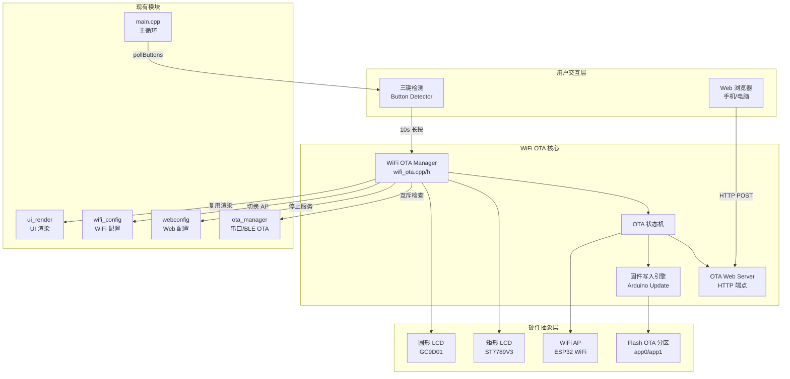
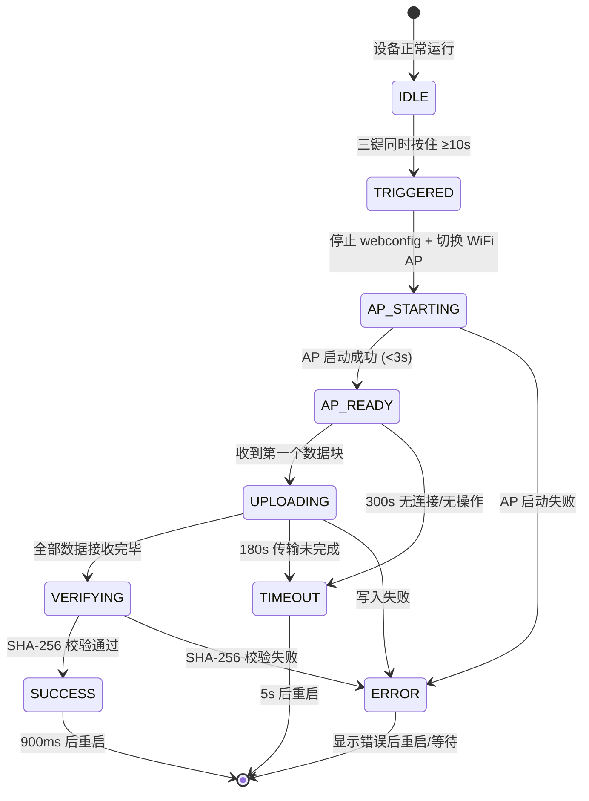
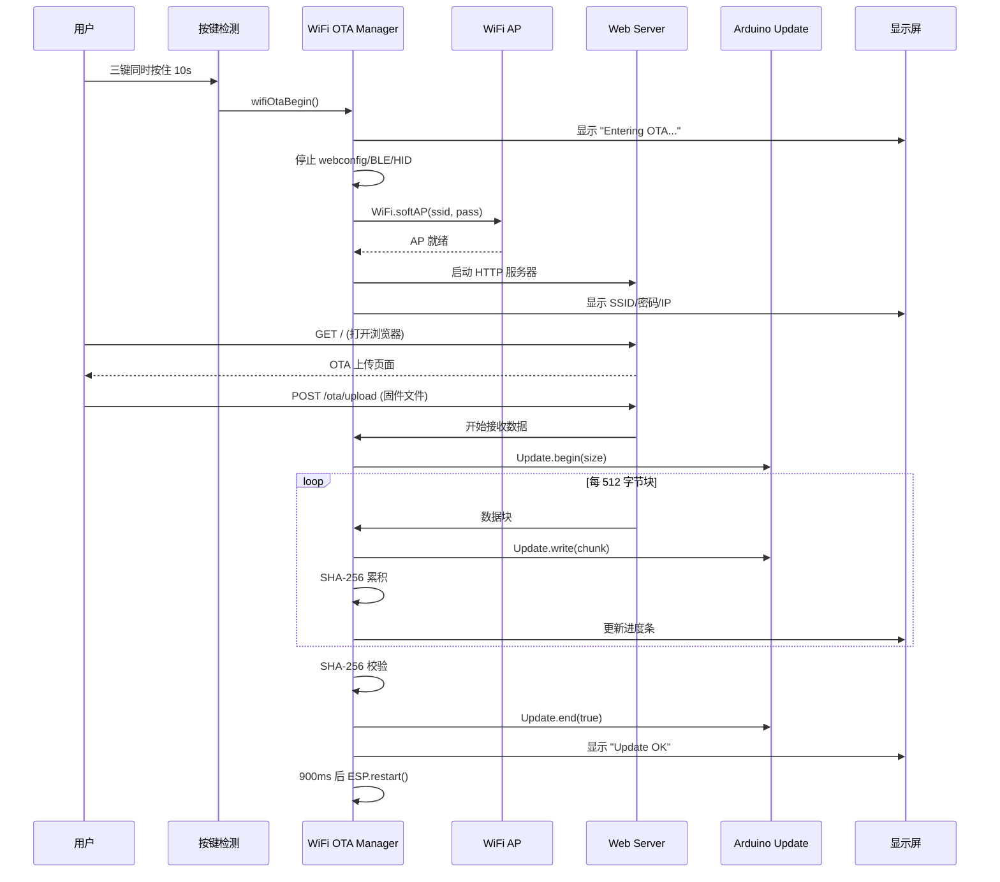

# WiFi OTA 技术设计文档

## 概述

本设计为 Kiro 键盘（ESP32-S3 五屏桌面控制器）实现 WiFi OTA 空中固件升级功能。用户通过三键同时长按 10 秒进入专用 OTA 模式，设备启动 WiFi AP 热点并提供 Web 上传界面，用户从手机或电脑连接热点后上传 .bin 固件文件完成升级。

### 设计目标

- **零侵入性**：OTA 未激活时不消耗任何额外资源（内存、CPU、WiFi 射频）
- **安全可靠**：SHA-256 校验 + 双分区回滚机制确保升级失败不变砖
- **用户友好**：矩形屏实时显示状态/进度/连接信息，无需外部工具辅助
- **与现有功能互斥**：OTA 期间停止所有 HID/BLE/按键功能，避免冲突

### 技术约束

| 约束项 | 值 |
|--------|------|
| MCU | ESP32-S3-N16R8 (16MB Flash, 8MB PSRAM) |
| OTA 分区大小 | 7MB (7,340,032 字节) |
| 框架 | Arduino (PlatformIO + pioarduino) |
| Web 服务器 | ESPAsyncWebServer 3.x |
| 显示 | 矩形 ST7789V3 172x320 + 圆形 GC9D01 160x160 |
| WiFi | 纯 AP 模式, WPA2, 单客户端 |


## 架构

### 高层架构图




### OTA 生命周期状态机



### 设计决策

| 决策 | 选择 | 理由 |
|------|------|------|
| OTA 触发方式 | 三键 10s 长按 | 避免误触，与现有 5s WiFi 清除手势兼容 |
| WiFi 模式 | 纯 AP (WIFI_AP) | 不需要外部网络，独立工作 |
| Web 框架 | 复用 ESPAsyncWebServer | 项目已依赖，减少 Flash 占用 |
| 文件传输 | multipart/form-data | 浏览器原生支持，无需 JS 依赖 |
| 校验方式 | SHA-256 | mbedtls 已内置，现有串口 OTA 复用同一机制 |
| 进度显示 | 复用 drawOtaRound/drawOtaRect | 与串口 OTA 视觉一致 |
| 超时策略 | 分阶段超时 | 等待阶段 300s，传输阶段 180s，兼顾用户体验和安全 |


## 组件与接口

### 新模块：`wifi_ota.h` / `wifi_ota.cpp`

```cpp
#ifndef WIFI_OTA_H
#define WIFI_OTA_H

#include <Arduino.h>

/// OTA 状态枚举
enum WifiOtaState : uint8_t {
    WIFI_OTA_IDLE = 0,       // 未激活
    WIFI_OTA_AP_STARTING,    // 正在启动 AP
    WIFI_OTA_AP_READY,       // AP 就绪，等待连接
    WIFI_OTA_UPLOADING,      // 固件上传中
    WIFI_OTA_VERIFYING,      // SHA-256 校验中
    WIFI_OTA_SUCCESS,        // 升级成功，等待重启
    WIFI_OTA_ERROR,          // 错误状态
    WIFI_OTA_TIMEOUT         // 超时状态
};

/// 错误类型枚举
enum WifiOtaError : uint8_t {
    WIFI_OTA_ERR_NONE = 0,
    WIFI_OTA_ERR_AP_FAIL,        // AP 启动失败
    WIFI_OTA_ERR_TOO_LARGE,      // 固件超过分区大小
    WIFI_OTA_ERR_EMPTY_FILE,     // 文件为空
    WIFI_OTA_ERR_WRITE_FAIL,     // 写入失败
    WIFI_OTA_ERR_SHA256_MISMATCH,// SHA-256 校验失败
    WIFI_OTA_ERR_TIMEOUT,        // 传输超时
    WIFI_OTA_ERR_UPDATE_END      // Update.end() 失败
};

/// 启动 WiFi OTA 模式（由三键检测触发调用）
/// 返回 true 表示成功进入 OTA 模式
bool wifiOtaBegin();

/// 主循环中调用，处理超时和状态转换
void wifiOtaLoop();

/// 查询 WiFi OTA 是否处于激活状态
bool wifiOtaIsActive();

/// 获取当前 OTA 状态
WifiOtaState wifiOtaGetState();

/// 获取当前进度百分比 (0-100)
uint8_t wifiOtaProgress();

/// 获取当前错误类型
WifiOtaError wifiOtaGetError();

/// 获取 OTA AP 的 SSID
String wifiOtaApSsid();

/// 获取 OTA AP 的密码
String wifiOtaApPassword();

#endif // WIFI_OTA_H
```


### 三键检测集成（main.cpp 修改）

```cpp
// 新增常量
static constexpr uint16_t WIFI_OTA_HOLD_MS = 10000;

// 在 pollButtons() 中新增逻辑：
// 1. 检测三键全部按下
// 2. 当持续时间 >= 10000ms 时调用 wifiOtaBegin()
// 3. wifiOtaIsActive() 为 true 时跳过所有按键处理
```

### Web 端点设计

| 端点 | 方法 | 功能 |
|------|------|------|
| `/` | GET | 返回 OTA 上传 HTML 页面（PROGMEM 嵌入） |
| `/ota/upload` | POST | multipart/form-data 接收固件文件 |
| `/ota/status` | GET | JSON 返回当前 OTA 状态和进度 |

### OTA 上传页面 HTML 结构

页面存储在 `wifi_ota_page.h` 中作为 PROGMEM 常量，包含：
- 设备名称和当前固件版本号显示
- 文件选择控件（accept=".bin"）
- 上传按钮
- JavaScript 进度条（XMLHttpRequest 上传 + 轮询 `/ota/status`）
- 状态/错误信息显示区域
- 响应式布局，适配手机屏幕

### 组件交互时序图




## 数据模型

### OTA 内部状态结构

```cpp
struct WifiOtaContext {
    WifiOtaState state;          // 当前状态
    WifiOtaError error;          // 错误类型
    unsigned long stateEnteredMs;// 进入当前状态的时间戳
    unsigned long lastActivityMs;// 最后活动时间（数据块/连接）
    size_t expectedSize;         // 预期固件大小
    size_t writtenBytes;         // 已写入字节数
    char expectedSha256[65];     // 预期 SHA-256 (hex string)
    mbedtls_sha256_context sha;  // SHA-256 累积上下文
    bool shaInitialized;         // SHA 上下文是否已初始化
    bool uploadInProgress;       // 是否有上传正在进行
    unsigned long lastDisplayMs; // 上次刷新显示的时间戳
};
```

### HTTP 响应数据格式

**GET `/ota/status` 响应：**
```json
{
    "state": "uploading",
    "progress": 45,
    "error": "",
    "version": "1.2.3"
}
```

**POST `/ota/upload` 成功响应：**
```json
{
    "ok": true,
    "message": "Update successful, rebooting..."
}
```

**POST `/ota/upload` 错误响应：**
```json
{
    "ok": false,
    "error": "file_too_large",
    "message": "固件大小超过 7MB 分区限制"
}
```

### 超时配置常量

```cpp
static constexpr unsigned long OTA_AP_TIMEOUT_MS     = 3000;   // AP 启动超时
static constexpr unsigned long OTA_IDLE_TIMEOUT_MS   = 300000; // 无连接/无操作超时 (5分钟)
static constexpr unsigned long OTA_UPLOAD_TIMEOUT_MS = 180000; // 传输超时 (3分钟)
static constexpr unsigned long OTA_CHUNK_TIMEOUT_MS  = 15000;  // 块间超时 (15秒)
static constexpr unsigned long OTA_REBOOT_DELAY_MS   = 900;    // 重启延迟
static constexpr unsigned long OTA_ERROR_DISPLAY_MS  = 5000;   // 错误显示时间
static constexpr size_t        OTA_MAX_FIRMWARE_SIZE = 7340032; // 7MB
static constexpr size_t        OTA_CHUNK_SIZE        = 512;    // 写入块大小
```


## 正确性属性

*正确性属性是在系统所有有效执行中都应成立的特征或行为——本质上是关于系统应做什么的形式化陈述。属性是连接人类可读规格与机器可验证正确性保证的桥梁。*

### 属性 1：三键触发充要条件

*对于任意*按键事件序列，WiFi OTA 模式被触发当且仅当三个 ScreenKey 按键同时处于按下状态且最早按下的按键持续时间达到 10000 毫秒。若任一按键在此之前释放，OTA 不应被触发。

**验证: 需求 1.1, 1.2**

### 属性 2：OTA 激活时按键输入无效

*对于任意*按键事件，当 WiFi OTA 处于激活状态（state ≠ IDLE）时，系统不应产生任何 HID 键盘报告输出或触发按键相关的状态变更（代理切换、语音输入等）。

**验证: 需求 1.3**

### 属性 3：AP 凭据格式正确性

*对于任意*有效的 ESP32 MAC 地址（6 字节），生成的 SSID 应匹配正则表达式 `^KiroKB-[A-F0-9]{6}$`，生成的密码应匹配 `^kiro-[A-F0-9]{6}$`，且两者的 6 字符后缀应相同（均为 MAC 后三字节的大写十六进制表示）。

**验证: 需求 2.1, 2.2**

### 属性 4：固件大小验证

*对于任意*文件大小值 `size`，当 `size > 7,340,032` 或 `size == 0` 时，OTA 系统应拒绝该上传请求且不执行任何 Flash 写入操作。当 `0 < size <= 7,340,032` 时，系统应接受该上传。

**验证: 需求 3.5, 3.6**

### 属性 5：上传互斥

*对于任意*时刻，当 `uploadInProgress == true` 时，新的上传请求应被拒绝并返回"设备忙"错误，系统同时最多处理一个固件上传。

**验证: 需求 3.9**


### 属性 6：SHA-256 分块计算一致性（Round-Trip）

*对于任意*字节序列 `data`，将其按最大 512 字节分块后依次调用 `mbedtls_sha256_update` 累积计算的最终哈希值，应与对完整 `data` 一次性计算 SHA-256 的结果完全相同。

**验证: 需求 4.2, 4.3**

### 属性 7：进度百分比计算正确性

*对于任意* `writtenBytes` 和 `expectedSize`（其中 `expectedSize > 0` 且 `writtenBytes <= expectedSize`），计算的进度百分比应等于 `min(100, writtenBytes * 100 / expectedSize)`，结果范围为 [0, 100] 的整数。

**验证: 需求 5.4**

### 属性 8：双屏进度同步

*对于任意*进度更新事件，圆形屏和矩形屏渲染时接收到的进度百分比参数值应相同。

**验证: 需求 5.7**

### 属性 9：超时状态机正确性

*对于任意* OTA 阶段和对应超时阈值（AP_READY 阶段 300s, UPLOADING 阶段数据块间 15s, 总传输 180s），当 `millis() - lastActivityMs >= threshold` 时系统应转入 TIMEOUT 状态。当 `millis() - lastActivityMs < threshold` 时系统应保持当前阶段不变。

**验证: 需求 4.5, 6.1, 6.2, 6.3**

### 属性 10：显示刷新频率限制

*对于任意*连续两次超时倒计时显示刷新，相邻刷新的时间间隔应 ≥ 1000 毫秒。

**验证: 需求 6.4**

### 属性 11：OTA 互斥性

*对于任意*系统状态，`wifiOtaIsActive()` 和 `otaIsActive()`（串口/BLE OTA）不应同时返回 true。当 WiFi OTA 激活时，串口/BLE OTA 的 `ota_begin` 请求应被拒绝并返回错误。

**验证: 需求 7.3, 7.4**

### 属性 12：错误类型与显示信息映射

*对于任意* `WifiOtaError` 枚举值（非 NONE），渲染到矩形屏的错误信息字符串应非空且与该错误类型对应（每种错误类型有唯一的非空提示文本）。

**验证: 需求 5.6**


## 错误处理

### 错误分类与处理策略

| 错误场景 | 错误类型 | 处理方式 | 恢复策略 |
|----------|----------|----------|----------|
| WiFi AP 启动失败 | `WIFI_OTA_ERR_AP_FAIL` | 显示错误 5s → 重启 | 重启后恢复正常模式 |
| 固件文件为空 | `WIFI_OTA_ERR_EMPTY_FILE` | HTTP 400 + 页面提示 | 用户重新选择文件 |
| 固件超过 7MB | `WIFI_OTA_ERR_TOO_LARGE` | HTTP 400 + 页面提示 | 用户重新选择文件 |
| Flash 写入失败 | `WIFI_OTA_ERR_WRITE_FAIL` | 中止 Update + 显示错误 | 当前分区不变，5s 后重启 |
| SHA-256 校验失败 | `WIFI_OTA_ERR_SHA256_MISMATCH` | 中止 + 显示校验失败 | 当前分区不变，5s 后重启 |
| 数据块超时 (15s) | `WIFI_OTA_ERR_TIMEOUT` | 中止上传 + 显示超时 | 5s 后重启 |
| 等待超时 (300s) | `WIFI_OTA_ERR_TIMEOUT` | 直接重启 | 恢复正常键盘模式 |
| 传输总超时 (180s) | `WIFI_OTA_ERR_TIMEOUT` | 中止上传 + 显示超时 | 5s 后重启 |
| Update.end() 失败 | `WIFI_OTA_ERR_UPDATE_END` | 显示错误 | 当前分区不变，5s 后重启 |

### 安全保障

1. **分区回滚**：所有错误/超时场景下，未完成的固件不会被设置为启动分区（`Update.end(true)` 仅在校验通过后调用）
2. **互斥保护**：`uploadInProgress` 标志防止并发上传导致的数据混乱
3. **资源清理**：退出 OTA 模式前释放所有资源（SHA 上下文、Web 服务器、WiFi AP）
4. **看门狗安全**：所有超时路径最终都会调用 `ESP.restart()`，避免设备卡死

### 内存与资源考量

| 资源 | 用量 | 说明 |
|------|------|------|
| 堆内存 (OTA 未激活) | 0 字节 | 所有状态为静态局部变量，未激活时不分配 |
| 堆内存 (OTA 激活) | ~4KB | AsyncWebServer 请求缓冲 + SHA-256 上下文 |
| PROGMEM (HTML 页面) | ~3KB | OTA 上传页面嵌入 Flash |
| 代码段增量 | ~8KB | wifi_ota.cpp + wifi_ota_page.h |
| WiFi 射频 | 仅 OTA 期间开启 AP | 正常模式下 WiFi 可能已在 STA/AP 模式 |
| FreeRTOS 任务 | 0 额外任务 | 复用 Arduino 主循环，异步 Web 服务器自带任务 |


## 测试策略

### 双重测试方法

本功能采用**属性测试 + 单元测试**互补策略：

- **属性测试 (Property-Based Testing)**：验证跨所有输入空间的通用正确性属性
- **单元测试 (Example-Based)**：验证特定场景、边缘条件和集成点

### 属性测试框架

- **库**：[Rapid](https://github.com/dundalek/rapid)（C++ 头文件库，适合嵌入式 PlatformIO 项目）
- **替代方案**：由于 ESP32 目标板难以直接运行 PBT，属性测试将在 native 平台（`platform = native`）上运行，仅测试纯逻辑模块
- **迭代次数**：每个属性测试最少 100 次迭代
- **标签格式**：`Feature: wifi-ota, Property N: <属性描述>`

### 可属性测试的模块（纯逻辑，无硬件依赖）

1. **三键触发判定逻辑** — 输入：按键时序序列 → 输出：是否触发
2. **AP 凭据生成** — 输入：MAC 地址 → 输出：SSID/密码字符串
3. **固件大小验证** — 输入：文件大小 → 输出：接受/拒绝
4. **SHA-256 分块计算** — 输入：随机字节数据 → 输出：哈希值
5. **进度百分比计算** — 输入：written/total → 输出：百分比
6. **超时判定逻辑** — 输入：时间戳序列 → 输出：是否超时
7. **错误信息映射** — 输入：错误枚举 → 输出：非空字符串

### 单元测试覆盖

| 测试场景 | 类型 | 验证内容 |
|----------|------|----------|
| BLE 配对阶段不触发 OTA | EXAMPLE | 需求 1.5 |
| AP 启动失败处理 | EXAMPLE | 需求 2.4 |
| HTML 页面包含 .bin 文件过滤 | EXAMPLE | 需求 3.3 |
| 成功写入后 900ms 重启 | EXAMPLE | 需求 4.7 |
| 校验失败后不设置启动分区 | EXAMPLE | 需求 4.4 |
| OTA 未激活时零资源占用 | EXAMPLE | 需求 7.1 |

### 集成测试

| 测试场景 | 验证内容 |
|----------|----------|
| 完整 OTA 流程 (AP → 上传 → 验证 → 重启) | 端到端功能 |
| WiFi AP 实际启动并可连接 | 需求 2.1-2.3 |
| HTTP multipart 上传实际文件 | 需求 3.4 |
| OTA 退出后设备恢复 | 需求 7.2 |
