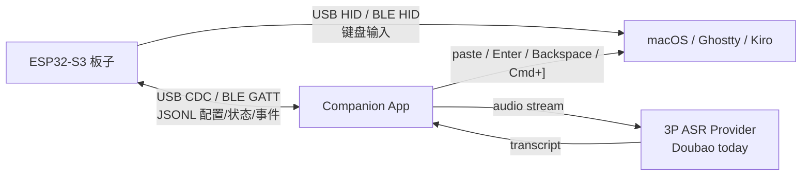

# Kiro 快捷键盘 (Vibe Coding Keyboard)

一个基于 ESP32-S3 的 5 屏桌面控制器，通过 USB HID 连接电脑，面向 Kiro / VS Code agentic coding 工作流。它配合 Ghostty 多 split 使用：3 个带彩屏的机械按键负责切换 Agent、语音输入、发送/取消/打断；圆形 LCD 显示当前选中 Agent 的状态表情；矩形 LCD 以四象限显示最多 4 个 Agent 的状态总览。

> 当前固件主线：USB HID + 5 屏 Agent 控制器 + Kiro CLI hook 串口状态同步。Web 配置和 BLE HID 代码仍保留在仓库中，但不是当前 `main.cpp` 启动路径。

---

## ✨ 功能特性

- **3 个屏幕按键**：每个按键带 0.85 寸彩屏，显示当前可执行动作
- **圆形状态 LCD**：0.71 寸圆形屏播放当前选中 Agent 的 Kiro 表情动画
- **矩形信息 LCD**：1.47 寸矩形屏以 2x2 布局显示最多 4 个 Agent 的名称和状态
- **USB HID 键盘**：USB 线即插即用，无需 PC 端驱动软件
- **Ghostty split 切换**：右键在普通状态下切换到下一个 Agent split
- **语音输入工作流**：支持 macOS 系统语音输入，以及 companion 驱动的 3P ASR
- **取消 / 编辑 / 打断**：左键处理停止/退出/打断，右键在语音编辑态处理 `Backspace`
- **Kiro hook 状态同步**：Kiro CLI hook 通过 companion 当前传输通道把 Agent 状态写入板子
- **焊接交换版支持**：可通过 `KIRO_HW_SWAP_KEY1_KEY3=1` 适配物理 Key1 / Key3 对调的板子

---

## 🧩 硬件配置

| 部件 | 型号 | 数量 |
|------|------|------|
| 主控 | Waveshare ESP32-S3-DEV-KIT-N16R8 (WiFi + BLE5, Xtensa 双核 240MHz, 16MB Flash, 8MB PSRAM) | 1 |
| 屏幕按键 | Waveshare 0.85inch ScreenKey Module B (ST7735, 128x128) | 3 |
| 圆形LCD | Waveshare 0.71inch LCD Module (GC9D01, 160x160, 圆形) | 1 |
| 矩形LCD | Waveshare 1.47inch LCD Module (ST7789V3, 172x320) | 1 |
| 连接 | 定制 PCB 板 (ESP32_5SCREEN_V0.1) | 1 |

详细接线见 [docs/硬件调试指南.md](docs/硬件调试指南.md)。

---

## 🎹 当前按键行为

| 输入 | 普通状态 | 语音录入中 | 语音编辑中 |
|------|----------|------------|------------|
| 左键 `key_left` | 取消 / 打断，发送 `ESC` | 停止语音输入并进入编辑态，发送 `ESC` | 退出编辑态，发送 `ESC` |
| 中键 `key_middle` | 开始 macOS 语音输入，发送双击 `Control` | 发送当前输入，发送 `Enter` | 发送当前输入，发送 `Enter` |
| 右键 `key_right` | 切换到下一个 Agent，发送 `Command + ]` | 停止语音输入，删除一字，并进入编辑态 | 短按 `Backspace`，长按连续发送 `Backspace` |

补充行为：

- 右键长按 5 秒会清除当前 Agent 槽位。
- Running 状态下按左键会发送 `ESC`，并把当前 Agent 本地状态置回 Idle。
- 录音态不允许切换 Agent，避免语音文字落到错误 split。
- 语音编辑态取消了双击清空输入，避免连续删除字符时误触清空。

---

## 🧠 Agent 状态显示

矩形 LCD 按 Ghostty split 排布显示 4 个槽位：

| Agent | Ghostty Split | 矩形屏区域 |
|-------|---------------|------------|
| Agent 1 | 左上 | 左上 |
| Agent 2 | 左下 | 左下 |
| Agent 3 | 右上 | 右上 |
| Agent 4 | 右下 | 右下 |

板子支持的状态：

| 状态 | 来源 | 显示 |
|------|------|------|
| Idle | 初始状态、`agentSpawn`、`stop` | 空闲表情 / `Idle` |
| Running | 中键发送输入、`userPromptSubmit` | 工作表情 / `Run` |
| Error | hook 上报工具错误 | 等待/错误表情 / `Error` |

Kiro CLI hook 事件通过 `scripts/kiro_board_hook.py` 转成 JSONL，优先交给 companion，再由 companion 通过当前板子传输通道写入板子；companion 不可用时可回退到 ESP32-S3 原生 USB CDC 串口。

---

## 🔌 通讯与语音架构

详细协议和图见 [shared/protocol/serial-protocol.md](shared/protocol/serial-protocol.md)。



分工原则：

- HID 只负责像键盘一样输入。
- USB CDC / BLE GATT 负责配置、状态、按键事件和 Agent 状态同步。
- `voice_engine=system` 时，板子触发 macOS 系统语音输入。
- `voice_engine=third_party` 时，companion 负责录音、调用 `asr_provider`、粘贴、发送和退格；当前 provider 是 `doubao`。

---

## 🛠 技术栈

- **框架**：Arduino (ESP32 Arduino Core 3.x) + PlatformIO
- **平台**：pioarduino fork
- **USB HID**：Arduino ESP32 内置 `USB.h` + `USBHIDKeyboard.h`
- **屏幕驱动**：[Arduino_GFX](https://github.com/moononournation/Arduino_GFX)
- **状态协议**：Kiro CLI hook -> Companion -> USB CDC / BLE GATT JSONL -> ESP32
- **3P ASR**：Companion provider adapter，当前实现 Doubao / Volcengine
- **BLE HID（备用）**：[HijelHID_BLEKeyboard](https://github.com/HijelHub/HijelHID_BLEKeyboard) (基于 NimBLE)
- **Web 配置（备用模块）**：`webconfig.*` + `webpage.h`，当前主固件未启动

---

## 📁 项目结构

```text
vibe-coding-keyboard/
├── platformio.ini          # PlatformIO 工程配置
├── include/                # 全局头文件，引脚和常量
│   ├── pins.h
│   ├── config.h
│   └── User_Setup.h
├── src/                    # 源代码
│   ├── main.cpp            # 当前主固件：USB HID + 5屏 UI + 串口 Agent 状态同步
│   ├── hid_actions.*       # USB HID 快捷键输出封装
│   ├── agent_registry.*    # Agent 槽位、状态名、Kiro hook JSONL 串口解析
│   ├── display_hardware.*  # 5 屏对象、SPI/CS、逻辑键到物理键映射
│   ├── ui_render.*         # ScreenKey、圆屏、矩形屏绘制
│   ├── kiro_expr_*.cpp     # 圆屏 Kiro 表情帧
│   ├── kiro_expressions.h  # 表情帧索引
│   ├── keymap.*            # 备用 Web 配置映射模块
│   ├── keyregistry.*       # 备用键名到键码映射表
│   ├── buttons.*           # 旧版按键扫描模块，当前 main.cpp 使用内置扫描逻辑
│   ├── ble_hid.*           # BLE HID 键盘封装，备用方案
│   ├── display.*           # 旧版显示管理模块，当前 main.cpp 直接管理 5 屏
│   ├── webconfig.*         # WiFi AP + Web 服务器 + REST API，备用模块
│   └── webpage.h           # 前端配置页面，备用模块
├── scripts/
│   ├── kiro_board_hook.py  # Kiro hook 到板子串口的 JSONL bridge
│   └── kiro_agent_start.sh # Kiro custom agent 启动辅助脚本
├── lib/                    # 手动提交的库
│   └── HijelHID_BLEKeyboard/
├── partitions/             # 16MB Flash 分区表
├── test/                   # 硬件局部验证程序
└── docs/                   # 设计和调试文档
```

---

## 🚀 快速开始

### 环境要求

- [PlatformIO IDE](https://platformio.org/) 扩展 (VS Code / Kiro)
- 首次编译会自动下载 pioarduino 平台、工具链和库依赖

### 编译与烧录

```bash
# 编译
pio run

# 编译 + 烧录到开发板
pio run --target upload --upload-port /dev/cu.usbmodem5B901608471

# 焊接交换版：物理 Key1 / Key3 对调
pio run -e esp32-s3-swap-key1-key3 --target upload --upload-port /dev/cu.usbmodem5B901608471

# 查看 CDC 串口日志
pio device monitor --port /dev/cu.usbmodem14C19F35A9082 --baud 115200
```

默认 `esp32-s3` 环境适用于正常接线版本；`esp32-s3-swap-key1-key3` 会定义 `KIRO_HW_SWAP_KEY1_KEY3=1`，让逻辑左键和右键的屏幕显示、按键输入、HID 行为一起交换。

### 串口区分

ESP32-S3 开发板会暴露两个不同用途的 USB 串口：

| 端口示例 | 用途 | 识别方式 |
|----------|------|----------|
| `/dev/cu.usbmodem5B901608471` | CH340 烧录口，仅用于 `pio run --target upload` | VID `1A86:55D3`，ioreg 显示 `USB Single Serial` |
| `/dev/cu.usbmodem14C19F35A9082` | ESP32-S3 原生 USB CDC，用于 Serial 日志和 hook 写入 | VID `303A:1001`，ioreg 显示 `Espressif ESP32...` |

端口号拔插后可能变化，可用下面命令重新确认：

```bash
ioreg -p IOUSB -l | grep -A5 Espressif
ls /dev/cu.usbmodem*
```

### 使用

1. 用 CH340 口烧录固件。
2. 用 ESP32-S3 原生 USB 口连接电脑，设备作为 USB HID 键盘工作，同时提供 CDC Serial。
3. 在 Ghostty 中打开同一个 tab 下的 4 个 split，分别运行不同 Kiro custom agent。
4. 按左键切换 split / Agent，按中键开始语音输入或发送输入，按右键取消、编辑或打断。
5. 配置 Kiro CLI hook 后，矩形屏会显示 Agent 名称和状态。

---

## 🔌 配置 Kiro CLI Hook（Agent 状态联动）

键盘可以实时显示 Kiro CLI agent 的运行状态。hook 脚本支持 USB 自动发现，无需手动指定串口路径。

**1. 安装依赖：**

```bash
pip install pyserial
```

**2. 在 `.kiro/agents/<agent>.json` 中配置 hooks（零配置，自动发现串口）：**

```json
{
  "name": "planner",
  "hooks": {
    "agentSpawn": [
      { "command": "python3 /path/to/ki-board/scripts/kiro_board_hook.py --agent-name planner" }
    ],
    "userPromptSubmit": [
      { "command": "python3 /path/to/ki-board/scripts/kiro_board_hook.py --agent-name planner" }
    ],
    "stop": [
      { "command": "python3 /path/to/ki-board/scripts/kiro_board_hook.py --agent-name planner" }
    ],
    "postToolUse": [
      { "command": "python3 /path/to/ki-board/scripts/kiro_board_hook.py --agent-name planner" }
    ]
  }
}
```

脚本通过 USB VID/PID (0x303A:0x1001) 和 product 字符串 "ki-board" 自动发现板子的 CDC 串口，换电脑或换 USB 口后无需修改配置。

端口解析优先级：`--serial-port` 参数 > `KIRO_BOARD_PORT` 环境变量 > 自动发现 > stdout 回退。

每个 custom agent 复用同一段 hook 配置，只需要改 `name` 和 `--agent-name`。hook 配置样例见 [docs/kiro-cli-hooks.example.json](docs/kiro-cli-hooks.example.json)。

**3. 验证板子是否可被自动发现：**

```bash
python3 -m serial.tools.list_ports -v
```

输出中应包含 `VID:PID=303A:1001` 和 `ki-board` 的设备条目。

**4. 启动示例：**

```bash
kiro-cli --agent planner chat --trust-all-tools
kiro-cli --agent coder chat --trust-all-tools
kiro-cli --agent reviewer chat --trust-all-tools
kiro-cli --agent runner chat --trust-all-tools
```

也可以使用 [scripts/kiro_agent_start.sh](scripts/kiro_agent_start.sh) 封装启动命令。

> `agentSpawn` 仅在 agent 首次启动时触发一次。板子重启后，需要对该 agent 发一条消息，触发 `userPromptSubmit`，矩形屏 tile 才会重新出现。

---

## 📖 文档

| 文档 | 内容 |
|------|------|
| [产品需求文档](docs/kiro-keyboard-prd.md) | 5 屏交互、Agent 模型、语音输入流程 |
| [技术设计](docs/kiro-keyboard-tech-design.md) | 当前固件实现边界、状态机、HID 映射 |
| [Agent 状态同步方案](docs/kiro-agent-status-sync.md) | Kiro hook 到 USB Serial 的同步协议 |
| [硬件调试指南](docs/硬件调试指南.md) | 接线表、烧录、分阶段验证、故障排查 |
| [技术概念百科](docs/技术概念百科.md) | 面向小白的技术概念通俗讲解 |

---

## ⚠️ 注意事项

- **当前主固件不启动 Web 配置**：`webconfig.*`、`keymap.*`、`webpage.h` 是保留模块，不代表当前 `main.cpp` 的运行行为。
- **Hook 串口自动发现**：`scripts/kiro_board_hook.py` 默认通过 USB VID/PID + product 字符串自动发现 CDC 串口，无需手动指定 `--serial-port`。如有多块板子可通过 `--serial-port` 或 `KIRO_BOARD_PORT` 环境变量指定。
- **pyserial 打开 CDC 口时避免复位**：脚本已设置 `dsrdtr=False`、`rtscts=False`、`dtr=False`、`rts=False`。
- **lib/ 目录随仓库提交**：HijelHID_BLEKeyboard 因 GitHub clone 易超时，已放入 `lib/` 直接提交。
- **Kiro hook 能力有限**：当前不自动识别审批态，也不读取真实 context token 数；矩形屏 context 先显示占位信息。

---

## 📄 许可

本项目代码供学习与个人使用。所用第三方库各自遵循其原始许可证。
