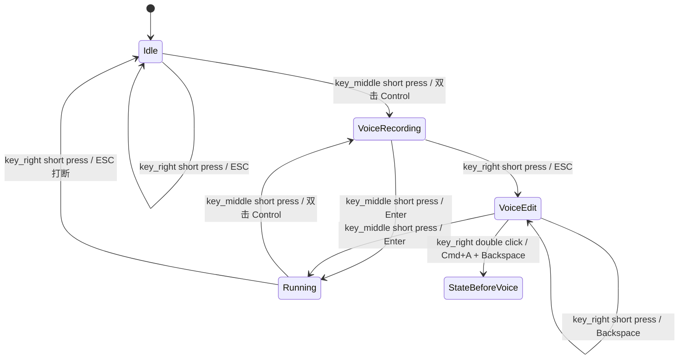

# Kiro Agentic Coding Keyboard 5屏交互产品需求文档

## 1. 背景

本项目是一个面向 Kiro / VS Code agentic coding 工作流的专属快捷键盘。设备通过 USB HID 模拟键盘输入，配合 Ghostty 中同一个 Tab 下的多个 Split，实现多 Agent 之间的快速切换、状态感知、语音输入、确认发送、取消删除、打断 Agent 等高频操作。

设备包含 5 个显示区域：

| 屏幕 | 位置 | 主要用途 |
|------|------|----------|
| 圆形 LCD | 独立圆屏 | 显示当前选中 Agent 的状态 |
| 矩形 LCD | 独立矩形屏 | 以四象限显示 4 个 Agent 的状态总览 |
| key_left 屏幕 | 左侧 ScreenKey | 切换 Agent |
| key_middle 屏幕 | 中间 ScreenKey | 根据 Agent 状态显示主要操作 |
| key_right 屏幕 | 右侧 ScreenKey | 根据 Agent 状态显示辅助操作 |

## 2. 产品目标

### 2.1 核心业务目标

1. 支持在多个 Agent 之间快速切换。
2. 支持利用操作系统自带语音转文字能力进行语音输入。
3. 支持将语音转成的文字发送给当前 Agent。
4. 支持取消或删除正在输入的文字。
5. 支持打断正在工作的 Agent。
6. 支持两种硬件焊接版本，通过一个配置项切换 key_left / key_right 的物理映射。

### 2.2 设计原则

1. 当前 Agent 是所有屏幕内容的中心上下文。
2. 圆形屏幕只表达状态，避免承载复杂信息。
3. 矩形屏幕承载 4 个 Agent 的状态总览和当前选中标记。
4. 三个 ScreenKey 显示可执行动作，屏幕内容必须和按下行为一致。
5. key_middle 优先承载当前状态下最常用的主动作。
6. key_right 承载取消、删除、拒绝、回退等辅助或负向动作。
7. 硬件版本差异不影响用户看到的逻辑位置：用户永远理解为 key_left / key_middle / key_right。

## 3. Agent 模型

### 3.1 默认 Agent 数量

默认支持最多 4 个 active custom agent。

| Agent | Ghostty 表现 | 说明 |
|-------|--------------|------|
| Agent 1 | 同一 Tab 下 Split 1 | 默认槽位 |
| Agent 2 | 同一 Tab 下 Split 2 | 默认槽位 |
| Agent 3 | 同一 Tab 下 Split 3 | 默认槽位 |
| Agent 4 | 同一 Tab 下 Split 4 | 默认槽位 |

Agent 不再只显示编号，统一显示为各自 custom agent 的 `name`。第一版示例命名为 `planner`、`coder`、`reviewer`、`runner`。

### 3.2 Agent 选中状态

设备内部维护一个 `selected_agent_index`，取值范围为 1 到 4。

按下 key_left 时：

1. `selected_agent_index` 切换到下一个槽位。
2. 到达最后一个槽位后再次按下，回到第一个槽位。
3. 设备通过 USB HID 发送 Ghostty 切换到下一个 Split 的快捷键：`Command + ]`。
4. 5 个屏幕刷新为新选中 Agent 的状态和操作。

### 3.3 Agent 状态

当前需求阶段至少定义以下状态：

| 状态 | 含义 | 圆屏表现 | 典型可用动作 |
|------|------|----------|--------------|
| Idle | 本地占位 / 未知 / 空闲 | 空闲图标 | 切换 Agent，语音输入，ESC |
| Running | Agent 正在执行任务 | 运行图标 / 动画 | 切换 Agent，语音追加输入，ESC 打断，查看 metadata |
| Error | Agent 出错或中断 | 错误图标 | 切换 Agent，清理 / 返回 |

第一版 Agent 状态可先由设备本地状态机手动维护或使用占位状态，不要求自动读取 Kiro / Ghostty 状态。

说明：Kiro 当前不支持在“需要人工 approve”时触发 hook，因此第一版不实现 Approval 状态自动识别，也不绑定 Approve / Reject 按键行为。相关能力放入未来规划。

说明：Kiro 当前也不支持“Agent 正在等待用户输入”的可靠 hook；同时 Kiro CLI 支持输入队列，因此第一版不实现 Wait 状态。用户可以在 Idle 或 Running 时直接发起语音输入。

## 4. 屏幕内容需求

### 4.1 圆形 LCD

圆形 LCD 显示当前选中 Agent 的状态。

要求：

1. 只显示当前选中 Agent，不显示其他 Agent。
2. 状态表达应一眼可识别，优先使用图标或轻量动画。
3. 不显示复杂文字，避免圆屏可读性差。
4. Agent 切换后立即更新。

建议状态视觉：

| 状态 | 建议视觉 |
|------|----------|
| Idle | Kiro ghost 空闲表情 |
| Running | Kiro ghost 专注 / 忙碌动画 |
| Error | Kiro ghost 异常 / 警告表情 |

### 4.2 矩形 LCD

矩形 LCD 采用上下左右四象限布局，每个区域对应一个 Agent，并显示该 Agent 的当前状态。当前选中的 Agent 需要有清晰标记，帮助用户知道当前操作对象。

Ghostty Split 与矩形屏区域对应关系：

| Agent | Ghostty Split | 矩形屏区域 |
|-------|---------------|------------|
| Agent 1 | 左上 | 左上 |
| Agent 2 | 左下 | 左下 |
| Agent 3 | 右上 | 右上 |
| Agent 4 | 右下 | 右下 |

每个区域显示：

| 信息 | 说明 | 优先级 |
|------|------|--------|
| Agent 名字 | custom agent `name` | P0 |
| 当前状态 | Idle / Running / Error | P0 |
| 交互态 | 当前选中 Agent 处于 Recording / Editing 时显示 | P0 |
| Context 占位 | 第一版显示 `CTX --` | P1 |

当前选中 Agent 标记：

1. 区域边框使用高亮色。
2. 区域左上角显示 `>` 或类似角标。
3. 非选中区域使用暗色边框。

状态显示规则：

| 状态 | 矩形屏内容 |
|------|------------|
| Idle | `agent name` + `Idle` + `CTX --` |
| Running | `agent name` + `Run` + `CTX --` |
| Voice Recording | 当前选中 Agent 区域显示 `REC` 和波浪线 |
| Voice Edit | 当前选中 Agent 区域显示 `EDIT` |
| Error | `agent name` + `Error` |

第一版 context 大小使用占位显示；后续如果 Kiro 没有直接暴露，需要再定义外部同步方式或估算方式。

### 4.3 key_left

key_left 固定用于切换 Agent。

显示内容：

1. 切换 Agent 图标。
2. 可选显示下一个 Agent 名字，例如 `coder` 表示按下后切换到 coder。

按下行为：

1. 切换到下一个 Ghostty Split。
2. 更新选中 Agent。
3. 刷新圆屏、矩形屏、key_middle、key_right。

### 4.4 key_middle

key_middle 根据当前选中 Agent 的状态显示主动作。

| Agent 状态 | key_middle 显示 | 按下行为 |
|------------|-----------------|----------|
| Idle | 录音图标 | 进入语音输入流程 |
| Running | 录音图标 | 进入语音输入流程，用于向 Kiro CLI 队列追加输入 |
| Voice Recording | 对勾图标 | 发送当前输入 |
| Voice Edit | 对勾图标 | 发送当前输入 |
| Error | 待定义 | 待定义 |

在 Idle / Running 状态下按下 key_middle：

1. key_middle 从录音图标切换为对勾图标。
2. key_right 切换为 ESC / 取消录音按钮。
3. 矩形屏切换为波浪线动画，表示正在录音。
4. 设备模拟 macOS 双击 Control，触发系统语音输入。

说明：语音输入不要求 Agent 处于等待状态。因为 Kiro CLI 支持队列，Agent Running 时也可以追加输入。

### 4.5 key_right

key_right 根据当前选中 Agent 的状态显示辅助动作。

建议定义：

| Agent 状态 | key_right 显示 | 按下行为 |
|------------|----------------|----------|
| Idle | ESC / Cancel 图标 | 发送 ESC |
| Running | Stop / Cancel 图标 | 发送 ESC，打断当前 Agent |
| Voice Recording | ESC / 取消录音图标 | 发送 ESC 停止系统语音输入，并进入 Voice Edit |
| Voice Edit | 退格图标 | 短按发送 Backspace；双击发送 Cmd+A + Backspace 清空并回到普通状态 |
| Error | 清理 / 返回图标 | 清理错误状态或回到 Idle |

针对 key_right 的定义：

1. Idle 状态下发送 ESC，作为轻量取消 / 返回操作。
2. Running 状态下发送 ESC，用于打断当前 Agent，并回到 Idle。
3. Voice Recording 状态下短按发送 ESC 停止系统语音输入，并进入 Voice Edit。
4. Voice Edit 状态下短按 key_right 发送 Backspace；双击 key_right 清空输入并回到普通状态，key_middle 恢复为录音图标。

## 5. 语音输入流程

### 5.1 目标

用户在需要向当前 Agent 输入内容时，可以按下 key_middle 开始语音输入，利用操作系统语音转文字生成文本，然后通过对勾发送给当前 Agent。

语音输入是全局能力，不依赖 Wait 状态。因为 Kiro CLI 支持队列，所以 Agent 在 Running 状态下也可以接收追加输入。

### 5.2 状态流转



### 5.3 屏幕变化

进入 Voice Recording 后：

| 屏幕 | 显示 |
|------|------|
| 圆形 LCD | 保留当前 Agent 状态，并叠加 Listening / 录音反馈 |
| 矩形 LCD | 波浪线动画 |
| key_left | 切换 Agent 图标 |
| key_middle | 对勾图标 |
| key_right | ESC / 取消录音按钮 |

进入 Voice Edit 后：

| 屏幕 | 显示 |
|------|------|
| 圆形 LCD | 当前 Agent 状态 |
| 矩形 LCD | 编辑提示 |
| key_left | 切换 Agent 图标 |
| key_middle | 对勾图标 |
| key_right | 退格按钮 |

### 5.4 HID 行为

已确认和待确认的快捷键：

| 行为 | 快捷键 |
|------|--------|
| 切换 Ghostty 下一个 Split | `Command + ]` |
| 开始系统语音输入 | 双击 Control |
| 发送当前输入 | Enter |
| 停止语音输入并进入编辑态 | ESC |
| 删除一个字符 | Backspace |
| 清空当前输入 | Cmd+A + Backspace |
| 取消输入 / 打断 Agent | ESC |
## 6. 硬件版本支持

### 6.1 问题

由于焊接问题，存在两个硬件版本：

| 硬件版本 | key_middle | key_left / key_right |
|----------|------------|----------------------|
| 标准版本 | 不变 | 物理顺序与逻辑顺序一致 |
| 交换版本 | 不变 | key_left 和 key_right 物理接线交换 |

### 6.2 产品要求

1. 软件层面使用逻辑键名：`key_left`、`key_middle`、`key_right`。
2. 用户交互和文档只描述逻辑键名，不要求用户理解 PCB 焊接差异。
3. 通过一个配置项支持两个硬件版本。
4. 配置项切换后，key_left / key_right 的显示内容和按下行为都要一起交换。
5. key_middle 始终不变。

### 6.3 配置建议

建议提供一个构建或运行配置：

```text
KEY_LEFT_RIGHT_SWAPPED = false  // 标准版本
KEY_LEFT_RIGHT_SWAPPED = true   // 焊接交换版本
```

> 具体实现方式后续在技术设计中确定；本 PRD 只定义产品行为。

## 7. 默认交互总表

| 当前模式 | key_left | key_middle | key_right | 圆屏 | 矩形屏 |
|----------|----------|------------|-----------|------|--------|
| Idle | 切换 Agent | 开始语音输入 | ESC | Idle 状态 | 四象限 Agent 总览 |
| Running | 切换 Agent | 开始语音输入 | ESC 打断 | Running 状态 | 四象限 Agent 总览 |
| Voice Recording | 切换 Agent | 发送输入 | ESC，进入编辑 | Listening 状态 | 当前 Agent 区域显示 REC |
| Voice Edit | 切换 Agent | 发送输入 | 短按 Backspace / 双击清空 | 当前 Agent 状态 | 当前 Agent 区域显示 EDIT |
| Error | 切换 Agent | 待定义 | 清理 / 返回 | Error 状态 | 错误信息 |

## 8. 非目标

当前阶段不处理：

1. 不实现代码。
2. 不定义具体 UI 像素稿。
3. 不实现 Kiro 状态自动识别。
4. 不设计 Web 配置页面。
5. 不扩展超过 4 个 Agent 的复杂管理。
6. 不实现 Approve / Reject 自动识别或快捷键绑定。

## 9. 未来规划

### 9.1 Approve / Reject 支持

Kiro Agent 有时会进入需要人工 approve 的状态，但当前 Kiro 不支持在该状态发生时触发 hook，设备无法可靠自动感知“需要审批”这一事件。因此第一版不实现 Approval 状态，也不在 key_middle / key_right 上绑定 Approve / Reject 行为。

未来如果 Kiro 支持审批态 hook 或提供稳定的状态 API，可增加：

1. `Approval` 状态识别。
2. 圆形屏审批状态图标。
3. 矩形屏审批提示和相关 metadata。
4. key_middle 显示 Approve 并触发确认动作。
5. key_right 显示 Reject 并触发拒绝动作。

### 9.2 真实状态和 context 数据

未来如果 Kiro 或外部同步服务能提供 Agent 状态、context 大小、当前任务摘要等信息，可替换第一版占位 metadata。

## 10. 待确认问题

1. Error 状态下 key_middle / key_right 的具体恢复动作是什么？
2. 是否需要为 key_left 的切换方向提供反向切换能力，例如长按切换上一个 Split？
