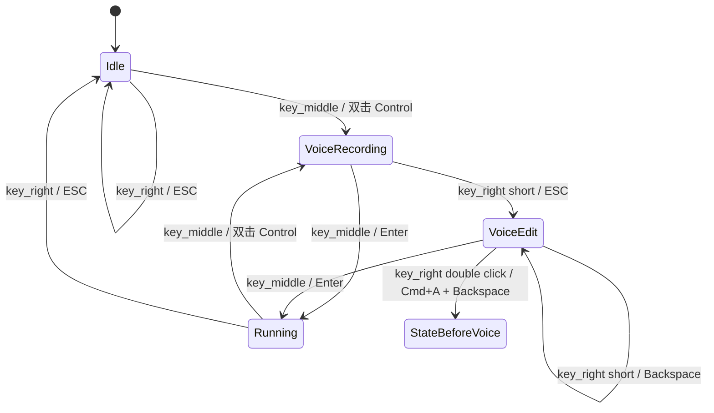

# Kiro Keyboard 技术设计

## 1. 目标

本文档把 `docs/kiro-keyboard-prd.md` 中的 5 屏交互需求落到固件实现设计。第一版目标是做出可运行的本地状态机原型，不依赖 Kiro / Ghostty 的外部状态接口。

## 2. 实现边界

第一版实现：

1. 使用 USB HID 发送快捷键。
2. 支持 4 个 custom agent：第一版示例为 `planner`、`coder`、`reviewer`、`runner`。
3. 使用本地状态机维护当前选中 Agent、Agent 状态和语音输入模式。
4. 矩形屏以四象限显示 4 个 Agent 的状态总览，并显示 custom agent 名字。
5. 圆形屏根据当前 Agent 状态播放 Kiro 表情动画。
6. 三个 ScreenKey 根据当前状态显示动作图标。
7. 支持标准焊接版本和 key_left / key_right 交换焊接版本。

第一版不实现：

1. 自动读取 Kiro Agent 状态。
2. 自动读取 context 真实 token 数。
3. 自动识别 Kiro 审批状态或绑定 Approve / Reject。
4. Web 配置页面。

## 3. 关键抽象

### 3.1 逻辑键

固件业务层只使用逻辑键：

| 逻辑键 | 业务含义 |
|--------|----------|
| `KEY_LEFT` | 切换 Agent |
| `KEY_MIDDLE` | 语音输入 / 发送 |
| `KEY_RIGHT` | ESC / 取消语音输入 / 清空 / 打断 |

### 3.2 物理 ScreenKey

PCB 上有 3 个物理 ScreenKey：

| 物理屏幕 | 默认逻辑键 |
|----------|------------|
| ScreenKey 1 | `KEY_LEFT` |
| ScreenKey 2 | `KEY_MIDDLE` |
| ScreenKey 3 | `KEY_RIGHT` |

如果 `KIRO_HW_SWAP_KEY1_KEY3=1`：

| 物理屏幕 | 交换后逻辑键 |
|----------|--------------|
| ScreenKey 1 | `KEY_RIGHT` |
| ScreenKey 2 | `KEY_MIDDLE` |
| ScreenKey 3 | `KEY_LEFT` |

要求：左右键交换时，屏幕显示和按键行为必须一起交换。

## 4. 状态模型

### 4.1 Agent 状态

```cpp
enum AgentState {
  AGENT_IDLE,
  AGENT_RUNNING,
  AGENT_ERROR
};
```

第一版默认所有 Agent 初始为 `AGENT_IDLE`。状态变化由按键行为推断：

1. 开始语音输入时进入 `VoiceRecording` 临时模式，不直接改变 Agent 状态。
2. 发送输入后，当前 Agent 状态设置为 `AGENT_RUNNING`。
3. Running 状态下按 ESC 打断后，当前 Agent 状态设置为 `AGENT_IDLE`。

说明：Kiro 当前没有可靠的 Wait hook，且 Kiro CLI 支持输入队列，因此第一版不实现 `AGENT_WAIT`。

### 4.2 交互状态

```cpp
bool voiceRecording;
bool voiceEditing;
AgentState stateBeforeVoice;
```

`voiceRecording` 和 `voiceEditing` 是设备交互模式，不是 Agent 长期状态。

录音期间：

1. key_middle 显示对勾。
2. key_right 显示 ESC / 取消录音。
3. 矩形屏在当前 Agent 区域显示 `REC` 和波浪线。
4. 圆屏保留当前 Agent 表情，并叠加 Listening 语义。

进入编辑态后：

1. key_middle 继续显示对勾。
2. key_right 继续显示退格。
3. 矩形屏在当前 Agent 区域显示 `EDIT`。
4. key_right 短按继续发送 Backspace，双击清空输入并退出编辑态。

### 4.3 状态流转



## 5. USB HID 映射

| 行为 | HID 输出 |
|------|----------|
| 切换下一个 Ghostty Split | `Command + ]` |
| 开始 macOS 语音输入 | 双击 `Control` |
| 发送当前输入 | `Enter` |
| 停止语音输入并进入编辑态 | `ESC` |
| 删除一个字符 | `Backspace` |
| 清空当前输入 | `Command + A`，然后 `Backspace` |
| 取消 / 打断 | `ESC` |

## 6. 屏幕渲染

### 6.1 圆形 LCD

圆形 LCD 使用现有 Kiro 表情帧：

| Agent 状态 | 表情集 |
|------------|--------|
| Idle | idle |
| Running | work |
| Error | wait |

第一版没有 Error 专用表情，先复用 wait 表情。

### 6.2 矩形 LCD

矩形 LCD 第一版显示 4 个 Agent 的状态总览和名字，布局与 Ghostty Split 排布一致：

| Agent | Ghostty Split | 矩形屏区域 |
|-------|---------------|------------|
| Agent 1 | 左上 | 左上 |
| Agent 2 | 左下 | 左下 |
| Agent 3 | 右上 | 右上 |
| Agent 4 | 右下 | 右下 |

每个区域显示：

1. Agent 名字：`planner`、`coder`、`reviewer`、`runner`
2. 当前状态：Idle / Run / Error
3. Context 占位：`CTX --`

当前选中 Agent：

1. 使用高亮边框。
2. 左上角显示 `>` 标记。

交互态：

1. 当前选中 Agent 处于 VoiceRecording 时，该区域显示 `REC` 和波浪线。
2. 当前选中 Agent 处于 VoiceEdit 时，该区域显示 `EDIT`。

### 6.3 ScreenKey

| 逻辑键 | 普通状态显示 | 特殊状态显示 |
|--------|--------------|--------------|
| key_left | Agent 切换图标 + 下一个 Agent 名字 | 不变 |
| key_middle | Mic | Recording / VoiceEdit 时显示 Check |
| key_right | ESC / Stop / Clear | Recording 时显示 ESC；VoiceEdit 时显示 Backspace |

## 7. 按键处理

每个逻辑键维护：

1. 当前稳定电平。
2. 上次读取电平。
3. 上次消抖时间。
4. 按下开始时间。

短按和长按：

1. 短按阈值：释放时小于 `LONG_PRESS_MS`。
2. 长按阈值：释放时大于等于 `LONG_PRESS_MS`。
3. key_right 在 VoiceEdit 状态下双击清空输入，并退出 VoiceEdit。

## 8. 后续扩展点

1. 接入真实 Agent 状态源后，替换本地占位状态；方案见 `docs/kiro-agent-status-sync.md`。
2. 接入真实 context 大小后，替换矩形屏四象限中的 `CTX --` 占位值。
3. 如 Ghostty 需要反向切换 Split，可把 key_left 长按映射为 `Command + [`。
4. 等 Kiro 支持审批态 hook 或稳定状态 API 后，再增加 Approval 状态、审批提示屏幕和 Approve / Reject 按键绑定。
