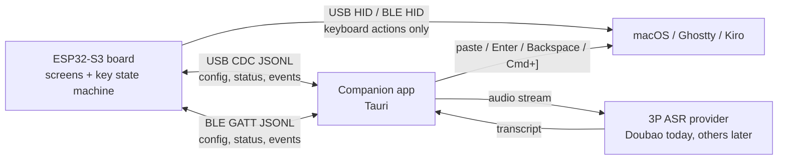
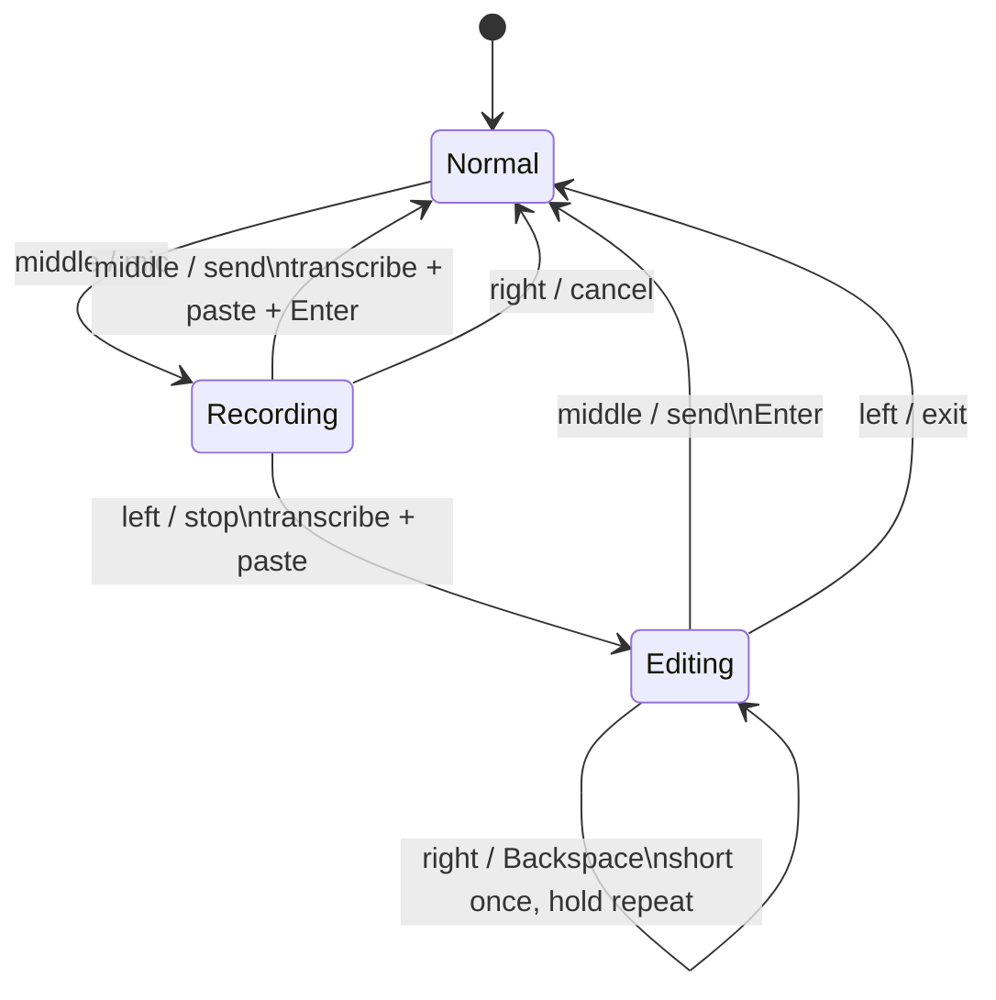

# Kiro Keyboard Board Protocol v1

Transports:

- USB CDC serial at 115200 baud.
- BLE GATT using the Kiro Board service.

Messages are UTF-8 JSON Lines. Every JSON object is followed by `\n`.
Unknown message `type` values must be ignored.

## Communication Model



Transport responsibilities:

- **USB HID / BLE HID**: keyboard output only (`Esc`, `Enter`, `Backspace`,
  `Cmd+]`, configured shortcuts).
- **USB CDC / BLE GATT**: bidirectional JSONL protocol for settings, key events,
  agent state, pairing/auth, and voice state.
- **Companion app**: owns third-party ASR providers and host text actions.
- **Board firmware**: owns button state, screen rendering, and HID fallback when
  the companion is unavailable.

## BLE GATT

- Service UUID: `6b69726f-6b62-0001-8000-00805f9b34fb`
- RX characteristic: `6b69726f-6b62-0002-8000-00805f9b34fb`
  - Companion -> board
  - Write / Write Without Response
- TX characteristic: `6b69726f-6b62-0003-8000-00805f9b34fb`
  - Board -> companion
  - Notify

Large JSONL payloads are split into chunks by the transport and reassembled by
the receiver until `\n`.

## Handshake

Companion sends:

```json
{"type":"hello","protocol":1,"client":"companion","version":"0.2.0"}
```

Board replies:

```json
{"type":"hello_ack","protocol":1,"fw":"0.2.0","capabilities":["usb_cdc","ble_gatt","keymap","voice_state"]}
```

Heartbeat:

```json
{"type":"ping","protocol":1}
{"type":"pong","protocol":1}
```

Firmware still accepts legacy `companion_hello` and `companion_ping` messages for
older companion builds and direct hook fallback.

## Board -> Companion

```json
{"type":"button_event","key":"middle","action":"short","held_ms":121,"selected_agent":0,"companion_online":true,"voice_recording":false,"voice_editing":false,"voice_intent":"voice_start"}
```

Fields:

- `key`: `left`, `middle`, or `right`
- `action`: `short` or `long`
- `held_ms`: press duration
- `selected_agent`: current board-side selected agent index
- `companion_online`: board-side heartbeat state before emitting this event
- `voice_recording`: board-side voice recording state
- `voice_editing`: board-side text-edit state
- `voice_intent`: optional semantic action for the companion (`voice_start`,
  `voice_commit_send`, `voice_commit_edit`, `voice_cancel`, `voice_send_edit`,
  `voice_delete`, `voice_exit_edit`)

Voice state machine:



## Companion -> Board

```json
{"type":"agent_state","agent_name":"planner","state":"running","session_id":"...","cwd":"..."}
{"type":"voice_state","state":"recording"}
{"type":"voice_engine","engine":"third_party","asr_provider":"doubao"}
{"type":"get_keymap","request_id":"..."}
{"type":"set_keymap","request_id":"...","keys":[{"label":"Voice","action_type":"voice","key":"Voice","modifiers":[]}]}
```

Board response:

```json
{"type":"keymap_response","request_id":"...","ok":true,"keys":[...]}
```

`agent_state` is the existing Kiro hook display message. `voice_state` lets the
companion reflect ASR lifecycle back to the board. `voice_engine` has two
engine classes:

- `system`: board owns macOS dictation HID.
- `third_party`: companion owns recording, ASR provider calls, paste, Enter, and
  Backspace. `asr_provider` is provider metadata for the companion and future
  protocol consumers; the board state machine only needs the engine class.

Firmware still accepts legacy `engine:"doubao"` as an alias for
`engine:"third_party"` and persists the normalized `third_party` value.

`get_keymap` and `set_keymap` are companion request/response messages. The board
stores the JSON key tile configuration in NVS and returns `keymap_response`. In
the current agent-controller firmware this persisted keymap is configuration
metadata; the runtime button state machine still handles voice, ESC, and agent
switching.

## Hook -> Companion

The Kiro hook script posts the same `agent_state` JSON to:

```text
http://127.0.0.1:47218/hook
```

The companion forwards the hook payload through the active board transport. In
Auto mode it prefers USB CDC and falls back to BLE GATT. If the companion app is
unavailable, the hook script falls back to writing directly to the board USB CDC
serial port.

## Pairing & Authentication

Trust is split by transport:

- **USB CDC is physically trusted** — no pairing or authentication. Plugging the
  cable is the authorization. (This also keeps the "hook writes directly to USB"
  fallback working when the companion app is down.)
- **BLE GATT requires authorization** — anyone nearby could connect wirelessly,
  so BLE commands are gated behind a shared token established by pairing.

Pairing binds **one board to one companion (Mac)** with a token stored in NVS
(namespace `kiropair`). It is application-level (not BLE link-layer bonding,
which macOS/CoreBluetooth does not expose to the app).

### Two ways to pair (both produce the same token)

1. **Over USB (easiest, just-works):** while connected via USB the companion
   sends `pair_request`; because USB is trusted the board immediately generates a
   token, stores it, and replies `pair_ok` — no code, no on-device confirm.
2. **Over BLE (numeric comparison + on-device confirm):** used when there is no
   USB cable. The board must be in its pairing window.

### Board pairing state

- `Unpaired`  — no token stored. **BLE** commands (`agent_state`, `get_keymap`,
  `set_keymap`) are rejected with `auth_required`. USB is unaffected.
- `Pairing`   — temporary BLE window (~30s) entered on the board by holding the
  **left + right** keys together for ~3s. The board shows a random 6-digit code.
- `Paired`    — a shared token is stored in NVS.

Over BLE, while unauthenticated the board only accepts `hello`, `ping`,
`pair_request`, `auth`, and `unpair`; everything else is answered with
`auth_required`. Over USB everything is accepted.

### Scheme A (BLE): numeric comparison + on-device confirm

1. User holds left+right on the board → board enters `Pairing`, displays a
   6-digit code, starts a ~30s window.
2. Companion connects and sends:
   ```json
   {"type":"pair_request","client":"<mac name>"}
   ```
3. Board (only if in `Pairing`) replies:
   ```json
   {"type":"pair_code","code":"482913","board_id":"<ble-mac>","name":"Kiro KB"}
   ```
   If not in `Pairing` it replies `{"type":"pair_failed","reason":"not_pairing"}`.
4. Companion shows the code and asks the user to compare it with the board screen
   and confirm **on the board**.
5. User presses the middle (●) key to confirm (or left ◀ to cancel). On confirm
   the board generates a random token, stores it in NVS (overwriting any previous
   binding), and sends:
   ```json
   {"type":"pair_ok","token":"<hex>","board_id":"<ble-mac>"}
   ```
   On cancel/timeout it sends `{"type":"pair_failed","reason":"cancelled|timeout"}`.
6. Companion stores the token in the OS keychain and records `paired_board_id`.

### Reconnect / authentication

After `hello`, a paired companion authenticates:
```json
{"type":"auth","token":"<hex>"}
```
Board replies `{"type":"auth_ok"}` (token matches) or
`{"type":"auth_required"}` (missing/mismatch → companion must re-pair).

### Unpair

Either side may unbind:
- Companion → board: `{"type":"unpair"}`; board clears NVS, replies
  `{"type":"unpaired"}`, returns to `Unpaired`. Companion clears the keychain
  token and `paired_board_id`.
- Board-local: re-entering `Pairing` and confirming overwrites the binding.

All pairing/auth messages also refresh the board-side companion-online heartbeat.
